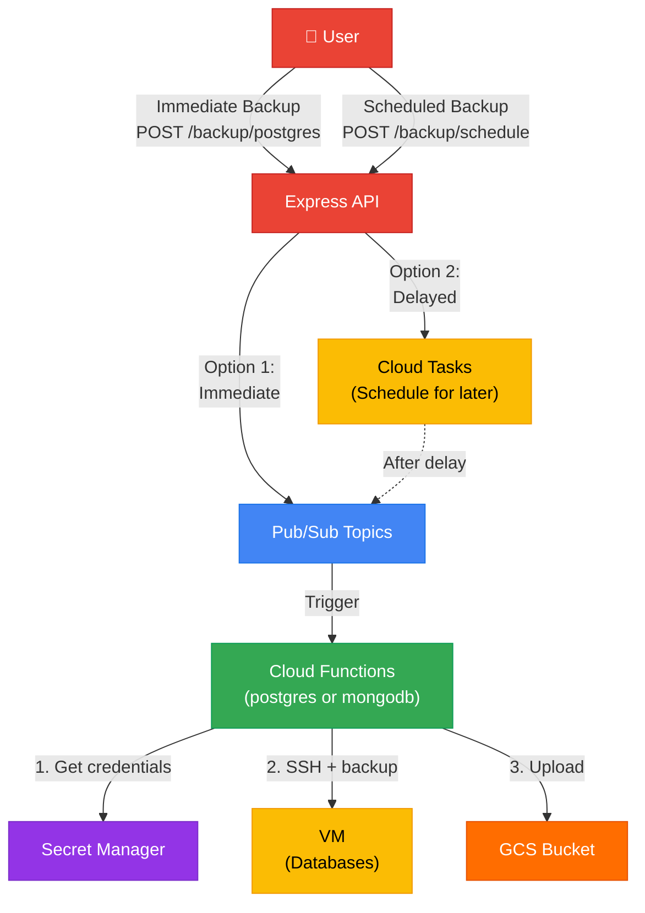

# Database Backup Microservices & Cloud Functions

This project implements a microservices architecture for managing database backups using Google Cloud Functions, Cloud Pub/Sub, Cloud Tasks, and Cloud Storage. It consists of an Express API for triggering/scheduling backups and Cloud Functions that perform the actual backup operations.

## Architecture


## Project Structure

```
.
├── cloud-functions/              # Google Cloud Functions
│   ├── mongodb-backup/           # Function to backup MongoDB
│   │   ├── index.js
│   │   └── package.json
│   └── postgresql-backup/        # Function to backup PostgreSQL
│       ├── index.js
│       └── package.json
│
└── express-api/                  # Express.js API Service
    ├── src/
    │   ├── config/               # Configuration (Env, Pub/Sub, Storage, Cloud Tasks)
    │   ├── middleware/           # Middleware (Auth, Error Handling, Validation)
    │   ├── routes/               # API Routes
    │   ├── services/             # Business Logic (Backup, Bucket, Task services)
    │   ├── utils/                # Utilities (Logger, etc.)
    │   └── index.js              # API Entry Point
    ├── package.json
    └── ...
```

## API Endpoints

All endpoints (except health checks) require an API key passed in the `x-api-key` header.

### General
| Method | Endpoint | Description | Auth Required |
|--------|----------|-------------|---------------|
| `GET` | `/` | API Information | No |
| `GET` | `/backup/health` | Health Check | No |

### Backup Triggers
| Method | Endpoint | Description | Auth Required |
|--------|----------|-------------|---------------|
| `POST` | `/backup/postgres` | Trigger an immediate PostgreSQL backup | Yes |
| `POST` | `/backup/mongodb` | Trigger an immediate MongoDB backup | Yes |

### Scheduled Backups
| Method | Endpoint | Description | Auth Required |
|--------|----------|-------------|---------------|
| `POST` | `/backup/postgres/schedule` | Schedule PostgreSQL backup. Body: `{ "delayMinutes": 60 }` | Yes |
| `POST` | `/backup/mongodb/schedule` | Schedule MongoDB backup. Body: `{ "delayMinutes": 60 }` | Yes |
| `GET` | `/backup/tasks` | List all scheduled backup tasks | Yes |
| `GET` | `/backup/tasks/:taskId` | Get details of a specific task | Yes |
| `DELETE` | `/backup/tasks/:taskId` | Cancel a scheduled task | Yes |

### Backup Management
| Method | Endpoint | Description | Auth Required |
|--------|----------|-------------|---------------|
| `GET` | `/backup/postgres/list` | List stored PostgreSQL backups | Yes |
| `GET` | `/backup/mongodb/list` | List stored MongoDB backups | Yes |
| `GET` | `/backup/download` | Get signed download URL. Query: `?fileName=...&expiresInMinutes=...` | Yes |

## Prerequisites

- Node.js
- Google Cloud Platform Project with:
  - Cloud Functions enabled
  - Cloud Pub/Sub enabled
  - Cloud Tasks enabled
  - Cloud Storage enabled
- Service Account credentials

## Setup

1. **Install dependencies:**
   ```bash
   cd express-api
   npm install
   
   cd ../cloud-functions/postgresql-backup
   npm install
   
   cd ../mongodb-backup
   npm install
   ```

2. **Environment Variables:**
   Configure `.env` in `express-api` with necessary GCP credentials and project details.

3. **Run API:**
   ```bash
   cd express-api
   npm start
   ```

